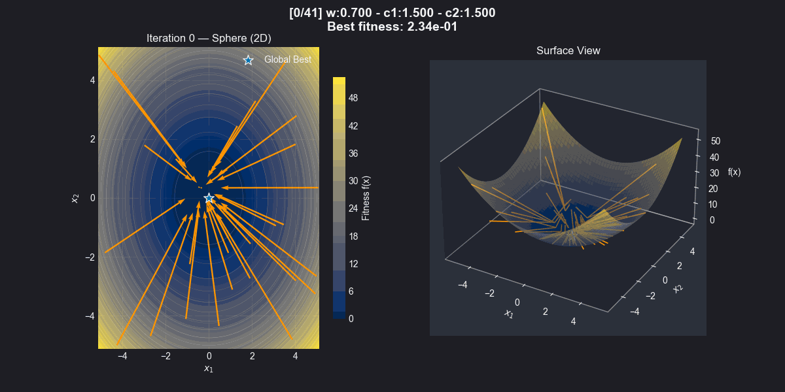

# Particle Swarm Optimization Benchmarking

This project implements and analyses Particle Swarm Optimization (PSO) across classic continuous benchmark functions. All code, experiments, visualisations, and commentary live in `pso_analysis.ipynb`.


## Repository Layout

- `pso_analysis.ipynb` — end-to-end workflow: implementation, experiments, analysis, and conclusions.
- `results/` — exported artefacts (`*.csv`, `*.png`, `pso_swarm.gif`) from completed experiments.
- `requirements.txt` — minimal dependency list for reproducing the notebook.

## Quick Start

1. **Create and activate a virtual environment (optional but recommended).**
   ```powershell
   python -m venv .venv
   .\.venv\Scripts\Activate.ps1
   ```
2. **Install required packages.** The notebook relies on NumPy, Pandas, Matplotlib, and SciPy. Install the latest stable versions:
   ```powershell
   pip install numpy pandas matplotlib scipy tqdm
   ```
3. **Launch Jupyter and open the notebook.**
   ```powershell
   python -m jupyter lab
   ```
4. **Run the master pipeline cell (`MASTER PIPELINE - RUN ALL`).** It rebuilds the experiment CSVs, regenerates figures, and recomputes summaries; use `Kernel > Restart & Run All` if you need a clean rerun.

The experiments were executed with Python 3.10 on Windows 10. Matching these versions will avoid API differences, but any recent Python 3.9+ environment should work.

## Notebook Roadmap

- **Section 1 — Setup:** Imports, random seed configuration, and definition of four benchmark functions (Sphere, Rosenbrock, Rastrigin, Ackley) with range checks.
- **Section 2 — PSO Implementation:** Global-best PSO with inertia weight, cognitive/social terms, velocity clamping, and reproducible RNG streams.
- **Section 3 — Experimental Design:** Configuration of the full sweep (4 functions × 3 dimensions × 30 runs = 360 experiments) and helper utilities for data collection.
- **Section 4 — Performance Results:** Aggregated tables, convergence curves, success-rate heatmaps, and bar charts exported to `results/`.
- **Section 5 — Convergence & Stability:** Convergence trajectories plus variance analysis across runs.
- **Section 6 — PSO Variants Comparison:** Parameter sweep (ω, c₁, c₂) and gbest vs lbest topology study with saved CSV summaries.
- **Section 7 — Conclusions:** Written synthesis of findings plus links to generated CSV/PNG artefacts.

## Key Results

- **Baseline throughput:** 360 experiments completed with an average runtime ≈1–2 seconds per run; raw logs are stored in `results/pso_experiments_detailed.csv`.
- **Success by function (global optimum reached ≥ 1e-6 tolerance):**
  - Sphere: **96.7%**
  - Ackley: **66.7%**
  - Rosenbrock: **33.3%**
  - Rastrigin: **33.3%**
- **Success by dimensionality:**
  - 2D: **100%**
  - 10D: **50.0%**
  - 30D: **22.5%**
- **Convergence behaviour:** Successful runs typically converged within 30–270 iterations; stalled runs plateaued early, especially on Rosenbrock and Rastrigin.
- **Stability:** Sphere exhibited the lowest variance across runs, while multimodal functions showed high dispersion, underscoring the importance of multiple trials.
- **Variants:** Parameter and topology sweeps are summarised in `results/pso_param_summary.csv` and `results/pso_topology_summary.csv`; the default configuration remains the most reliable overall.

Refer to `results/performance_heatmaps.png` and `results/convergence_curves_all.png` for the visual evidence supporting these metrics.

## Reproducing the Study

1. Execute Sections 1–3 to rebuild the PSO implementation and experiment scaffolding.
2. Run the master pipeline cell in Section 4; progress logs appear every dimension block, and refreshed CSV/PNG outputs land in `results/`.
3. Use the summarisation cells in Sections 4–6 to regenerate tables, plots, and descriptive text.
4. Review Section 7 for the automatically generated narrative summary; adjust parameters or add new benchmarks as needed.

If you only need the published artefacts, open the notebook without execution—the stored outputs reflect a full successful run.

## Troubleshooting

- **Long runtimes:** The complete sweep takes several minutes on a typical laptop CPU. Reduce the number of runs per configuration (e.g., 5 instead of 30) for exploratory testing, then restore to 30 for the final report.
- **Floating-point drift:** Results rely on consistent seeding (`SeedSequence`). If you alter seeds, expect different success rates; document any changes for reproducibility.
- **Memory usage:** Each run saves intermediate fitness history. Delete large CSVs in `results/`
