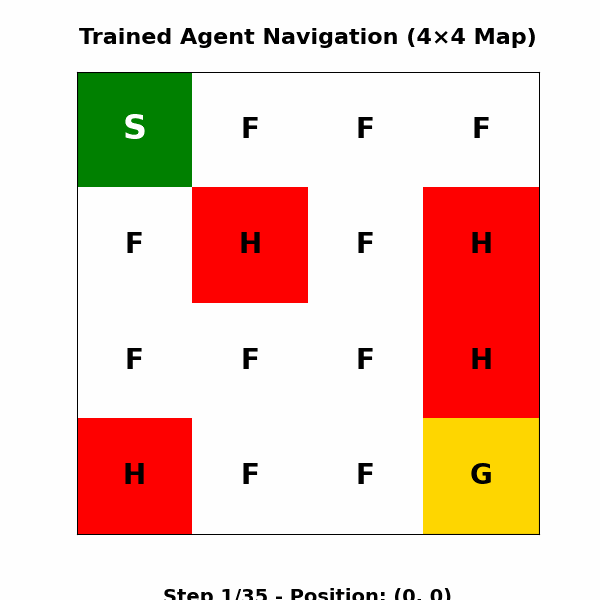

# Warehouse Robot Reinforcement Learning



This project trains a warehouse robot to navigate a slippery floor with tabular Q-learning. The FrozenLake-v1 environment from Gymnasium stands in for the warehouse, modelling start bays, spill hazards, and stochastic wheel slip. All experiments, plots, and commentary live in `warehouse_robot_rl.ipynb`.

## Repository Layout

- `warehouse_robot_rl.ipynb` — structured notebook covering exploration, agent design, training, evaluation, reward shaping, and visualisation.
- `requirements.txt` — minimal dependency list for reproducing the notebook.
- `robot_navigation.gif` — animation of a trained 4×4 agent reaching the goal.

## Quick Start

1. **Create and activate a virtual environment (optional but recommended).**
   ```powershell
   python -m venv .venv
   .\.venv\Scripts\Activate.ps1
   ```
2. **Install dependencies.**
   ```powershell
   pip install -r requirements.txt
   ```
3. **Launch Jupyter Lab or Notebook and open `warehouse_robot_rl.ipynb`.**
   ```powershell
   python -m jupyter lab
   ```
4. **Run the notebook top-to-bottom.** Each task section is fully annotated, so you can execute cell-by-cell or choose `Kernel > Restart & Run All`.

The notebook was executed with Python 3.10, Gymnasium 1.2.1, NumPy 2.2.6, and Matplotlib 3.8. Please match those versions (or newer) to avoid API changes.

## Notebook Roadmap

- **Task 1 — Environment Familiarisation:** Builds intuition for the 4×4 FrozenLake map, visualises the grid, inspects state/action spaces, and demonstrates how slippery transitions randomise moves.
- **Task 2 — Q-Learning Agent:** Implements the `QLearningAgent` with epsilon-greedy exploration, tabular Q-updates, and configurable decay scheduling.
- **Task 3 — Training Loop:** Runs 10,000 training episodes on the 4×4 floor, tracking rewards, steps, and epsilon to show convergence behaviour.
- **Task 4 — Evaluation & Baselines:** Compares the learned policy against random and Manhattan heuristics over 1,000 evaluation episodes and plots success/efficiency bar charts.
- **Task 5 — Hyperparameter Experiments:** Sweeps learning rate, discount factor, and epsilon decay to quantify how each knob affects long-run success.
- **Task 6 — Larger Map & Reward Shaping:** Scales to the standard 8×8 map, introduces distance-based reward shaping, contrasts results with the sparse-reward baseline, and summarises insights in composite plots.
- **Bonus — Visualisation:** Captures a trained episode path and saves `robot_navigation.gif` for quick previews.

## Key Results

- **4×4 Training Performance:** After 10,000 episodes (α=0.2, γ=0.99, ε_decay=0.9995) the agent reaches the goal in **67.2%** of the last 1,000 episodes, averaging **38.6** steps because slips force recovery moves.
- **Policy Comparison (4×4, 1,000 eval episodes):**
  - Q-learning policy (ε fixed at 0.01): **66.1%** success, **40.0** steps.
  - Random policy: **1.6%** success, **7.8** steps on the rare successes.
  - Manhattan heuristic: **6.6%** success, **5.5** steps when it survives.
- **Hyperparameter Insights:** Moderate learning rates (0.1–0.2) and high discounting (0.99) consistently outperform lower values; decay speed primarily affects how quickly rewards ramp but not the asymptotic plateau.
- **8×8 Scaling:** Sparse-reward training fails to converge (**0%** success), while reward shaping (distance bonus, hole penalty, step penalty) lifts success to **20.7%** with far shorter paths (**69** steps vs **96.9**).
- **Comparative Dashboard:** The notebook bundles these metrics into side-by-side bar charts and scatter plots linking environment complexity (states) to success rates.

Explore the plotted learning curves, hyperparameter charts, and summary tables inside the notebook for deeper context.

## Reproducing Experiments

1. **Train the 4×4 agent:** Execute Tasks 1–3 sequentially. Progress logs print every 1,000 episodes; random seeds ensure repeatability.
2. **Recreate evaluation figures:** After training, run Task 4 to regenerate the comparison plots and statistics.
3. **Re-run sweeps:** Task 5 reinitialises agents with fresh seeds for each configuration, so you can tweak ranges and observe new curves.
4. **8×8 Experiments:** Task 6 trains both the sparse-reward and reward-shaped agents (10,000 episodes each) and visualises the difference.
5. **Animation:** The final section exports `robot_navigation.gif`; rerun if you want to capture a fresh trajectory.

If you only need the results, open the notebook in a read-only session—the current outputs were saved after full execution.

## Troubleshooting

- **Gymnasium rendering warnings:** The notebook uses `render_mode='ansi'` for text-based grids. Update Gymnasium to the version in `requirements.txt` if rendering fails.
- **Runtime:** Each 10,000-episode run takes a few minutes on a standard laptop CPU. Reduce `num_episodes` for smoke tests, then revert for published numbers.
- **Variance:** Due to stochastic transitions, success rates fluctuate. Leave the provided `np.random.seed(...)` calls intact for reproducibility.

## License and Reuse

Created for the ACIT 4610 final group project.

## Acknowledgements

AI tools were used to assist with documentation and structuring this project.
